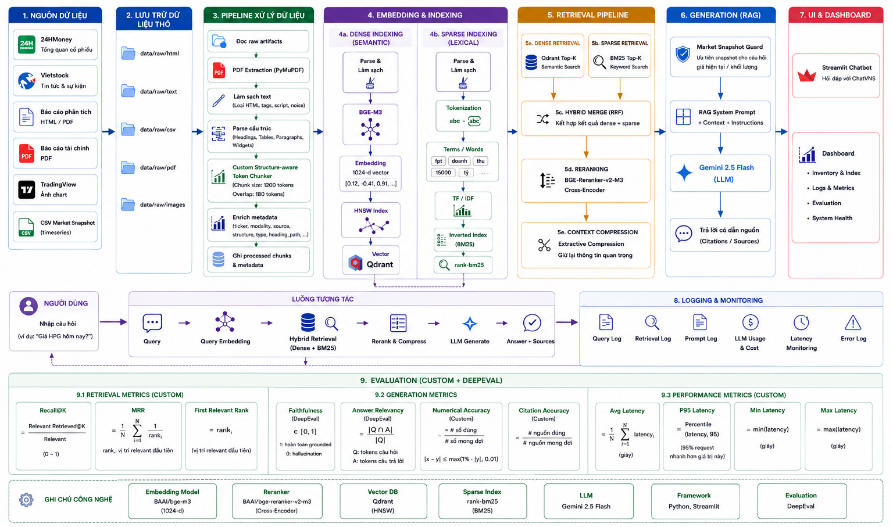

# ChatVNS

MVP chatbot RAG cho dữ liệu cổ phiếu Việt Nam. Repo này tập trung vào một flow gọn:

`collect raw data -> process/chunk -> embed/index -> retrieve -> answer -> Streamlit UI`

## Tài liệu chính

- Data spec: `documents/DATA.md`
- Nguồn câu hỏi sidebar: `documents/Q&A.md`
- Q&A JSON được sinh ra: `data/processed/q&a.json`

## Cấu trúc project

```text
app
├── pipeline.py
├── processing
│   └── vector_store.py
├── retriever.py
├── rag.py
├── streamlit_app.py
├── evaluate.py
└── prune_raw_runs.py

bot-collect-data
└── crawl_raw_data.py

documents
├── DATAFLOW.md
└── Q&A.md

data
├── raw
├── processed
├── evaluation
└── logs
```

## Setup
dự án sử dụng uv thay cho pip, mang lại tốc độ setup nhanh đáng kể

1. Khởi tạo dự án rỗng: lệnh này sẽ tạo các files được setup sẵn: .gitignore, .python-version, pyproject.toml, main.py, README.md

```bash
uv init --python 3.11
```

2. Cài dependencies:

```bash
uv add -r requirements.txt
```

3. Chạy playwright

```bash
uv run playwright install chromium
```

## Chạy pipeline

Collect raw data:

```bash
uv run python -m app.pipeline collect --tickers tickers --include-news --include-charts
```

Xử lý raw data và index vào Qdrant:

```bash
uv run python -m app.pipeline index
```

Mở Streamlit:

```bash
uv run python -m app.pipeline chat
```

Website Streamlit có 2 page:

- `Chatbot`: hỏi đáp RAG trên dữ liệu cổ phiếu.
- `Dashboard`: giám sát dữ liệu raw/processed, indexed chunks, crawl summary và evaluation report.
- Giao diện dùng bộ mascot trong `assets/mascots`, theme tiếng Việt và `streamlit-extras` cho metric cards.

Chạy end-to-end:

```bash
uv run python -m app.pipeline all --tickers tickers --include-news --include-charts
```

Khi chạy `index` hoặc `all`, pipeline sẽ sync `documents/Q&A.md` sang `data/processed/q&a.json` để Streamlit hiển thị sidebar questions.

## Luồng console

```text
========================================================================
ChatVNS pipeline
Command: all
Flow: collect raw data -> process/chunk -> embed/index Qdrant -> Streamlit
========================================================================

[1/4] Start Qdrant
[2/4] Collect raw data
[3/4] Process and index
[4/4] Open Streamlit
```

## Đánh giá hệ thống

Chạy script đánh giá retrieval, generation và performance:

```bash
.\.venv\Scripts\python.exe -m app.evaluate
```

Tùy chỉnh top-k, số lần đo latency và file cases:

```bash
.\.venv\Scripts\python.exe -m app.evaluate --top-k 5 --repeats 3 --cases data/evaluation/eval_cases.json
```

Bộ evaluation hiện tại đã được rút gọn về một flow duy nhất. Chỉ cần chạy một lệnh để report/Dashboard có đủ: Recall@5, Precision@5, Hit Rate@5, MRR, Faithfulness, Answer Relevancy, Numerical Accuracy và Citation Accuracy:

```bash
.\.venv\Scripts\python.exe -m app.evaluate
```

Khi `.env` có `GEMINI_API_KEY`, DeepEval mặc định dùng `GEMINI_MODEL`. Muốn ép dùng model khác thì truyền `--eval-model`, ví dụ `--eval-model gemini-1.5-flash` hoặc `--eval-model gpt-4o-mini`.
Nếu DeepEval lỗi quota/API hoặc eval case auto-generated thiếu reference cho số liệu/source, report vẫn có score fallback cục bộ và ghi lý do trong `fallback_metrics` của từng case.

Report được sinh ra tại:

- `data/evaluation/reports/*.json`
- `data/evaluation/reports/*.md`

## Dọn raw artifacts cũ

Xem trước những file cũ sẽ bị dọn:

```bash
.\.venv\Scripts\python.exe -m app.prune_raw_runs --keep 2
```

Chỉ dọn cho một scope cụ thể, ví dụ `FPT`:

```bash
.\.venv\Scripts\python.exe -m app.prune_raw_runs --keep 2 --scope FPT
```

Thực sự xóa file:

```bash
.\.venv\Scripts\python.exe -m app.prune_raw_runs --keep 2 --apply
```

Script này chỉ tác động tới `data/raw` và giữ lại `N` phiên bản mới nhất cho từng artifact logic như `stock_overview`, `ticker_news`, `analysis_report_detail_01`...

## Ghi chú

- Qdrant chạy qua `docker compose up -d qdrant`
- Embedding model mặc định: `BAAI/bge-m3` với vector dimension 1024. Embedding bắt buộc gọi Hugging Face API qua `HF_API_KEY`/`HG_API_KEY`; code không tải hoặc chạy model embedding local. Sau khi đổi embedding model/dim/API URL, chạy lại `python -m app.pipeline index` để rebuild Qdrant collection.
- Retrieval dùng hybrid dense + BM25, sau đó rerank candidates bằng Hugging Face API với `BAAI/bge-reranker-v2-m3`. Reranker tự retry khi timeout/429/5xx và fallback về thứ tự hybrid nếu API vẫn lỗi. Có thể cấu hình `RERANK_API_RETRIES`, `RERANK_API_RETRY_BACKOFF`, tắt bằng `RERANK_ENABLED=0`, hoặc đổi model bằng `RERANK_MODEL`.
- Answer chính dùng extractive context compression trước khi gọi LLM: chọn các câu liên quan nhất trong từng chunk, vẫn giữ source metadata. Có thể tắt bằng `CONTEXT_COMPRESSION_ENABLED=0`.
- PDF text được đọc bằng PyMuPDF. Project không dùng OCR; PDF scan không có text layer sẽ không trích được nội dung chữ.
- LLM mặc định: Gemini, đọc từ `.env`
- Nếu chưa có `GEMINI_API_KEY`, app sẽ fallback về context retrieved thay vì gọi LLM

## Lộ trình gọn cho đánh giá và logs

1. **Local interaction logs:** Mỗi câu hỏi gửi tới chatbot đều được ghi vào `data/logs/chatbot_interactions.jsonl`.
2. **Dashboard:** Theo dõi số lượt hỏi, độ trễ (latency), số lượng nguồn (source count), inventory thô/đã xử lý và báo cáo đánh giá.
3. **Offline evaluation:** Chạy `app.evaluate` để tạo báo cáo về retrieval, generation và hiệu năng.
4. **Metrics:** Bộ metrics đã rút gọn gồm `Recall@5`, `Precision@5`, `Hit Rate@5`, `MRR`, `Faithfulness`, `Answer Relevancy`, `Numerical Accuracy`, `Citation Accuracy`.
5. **Evaluate:** `python -m app.evaluate` tạo một report chung, trong đó DeepEval bổ sung `Faithfulness` và `Answer Relevancy` bằng LLM-as-a-Judge.

## Quick start
Bật Docker, extract source code rồi chạy các bash sau:

1. Cài dependencies
```bash
uv add -r requirements.txt
```

2. Chạy playwright
```bash
uv run playwright install chromium
```

3. Chạy project
3.1. Chạy toàn bộ pipeline end-to-end: crawl data -> mở Streamlit
```bash
uv run python -m main
```

3.2. Chỉ mở Streamlit
```bash
uv run python -m app.pipeline chat
```

4. Chạy evaluate
```bash
uv run python -m app.evaluate
``` 

5. Lập lịch cào dữ liệu định kỳ (optional)
```bash
.\bot-collect-data\start_scheduler.ps1
.\bot-collect-data\start_scheduler.ps1 -SkipInitialCrawl
.\bot-collect-data\stop_scheduler.ps1
```

## Kiến trúc tổng thể
